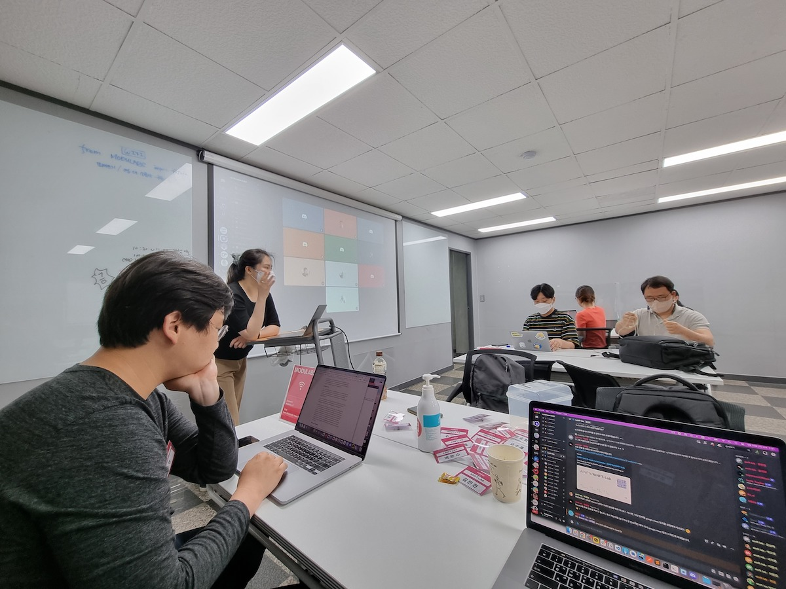

# 2주차

## 1. [Linda Xie 의 NFT 초보자 가이드](https://docs.google.com/document/d/14kx02z5MMyazIYvSWTQee7CQK3RiPWb7RDqKI0TybYY/edit?usp=sharing) - 조현길 연구원님

- [원문](https://linda.mirror.xyz/df649d61efb92c910464a4e74ae213c4cab150b9cbcc4b7fb6090fc77881a95d)
- [저자](https://www.linkedin.com/in/lindaxie/details/experience/)
- [대표아티클](https://twitter.com/ljxie/status/1471313801307820032?s=20&t=_3kfUOK-9bMf9nzqV-6Smw)

## 2. Discord용 QA Chatbot 만들기 - 장래영 랩짱

[보기 편한 Notion 링크](https://link.ainize.ai/discord-chatbot)

### 개요

- AINFT Builder Discord App을 이용해 나만의 QA Chatbot을 만들어 봅니다
- Prompt Dialog 기반으로 Customize된 AI Model을 만들어 봅니다
- Discord Bot을 활용해 봅니다

### 오늘 튜토리얼 세션에서 진행 할 내용

1. 나만의 Discord 서버를 만들어본다
2. AINFT Bot Builder를 이용해 Discord용 QA Chatbot을 만들어 본다
3. 만들어진 Discord bot을 사용해본다 (bot에서 사용 할 수 있는 다양한 command 들)
4. AI QA Chatbot과 NFT와의 관계를 고민해본다

### 준비물

- PC나 노트북
- discord 설치 및 가입 - [https://discord.com/](https://discord.com/)

### 1. 내 Discord 서버 만들기

(admin 권한이 필요해서 직접 만들어야 합니다)

1. 서버 추가하기를 눌러서 서버 생성

   

2. `직접 만들기` 선택

   

3. `나와 친구들의 위한 서버` 선택

   

4. 적당한 서버 이름을 넣기 (ex. QA Chatbot)

   

5. 완성!

   

### 2. AINFT Builder App 추가하기

1. 링크 클릭 - [https://discord.com/oauth2/authorize?client_id=963621297705848932&permissions=397553171568&scope=bot%20applications.commands](https://discord.com/oauth2/authorize?client_id=963621297705848932&permissions=397553171568&scope=bot%20applications.commands)
2. ainft-builder bot에 권한 주기 (서버 목록에서 위에서 만드신 서버를 선택해 주세요)

   

3. 서버에 ainft-builder-bot 봇 유저 추가와 ainft-bot-factory 채널이 생겼는지 체크

   

### 3. QA Chatbot 만들기

1. #ainft-bot-factory 채널에서 `/ainft init qa_chatbot_1` 입력

   

2. 원하는 AI Model 선택

   - 선택 가능한 모델은 `[GPT-J 6B (Eng)](https://huggingface.co/EleutherAI/gpt-j-6B)` 와 `[KoGPT 6B (Kor)](https://huggingface.co/kakaobrain/kogpt)`  2가지가 있습니다. GPT-J 6B는 EleutherAI가 공개한 영어 기반 모델이며, KoGPT 6B의 경우 KakaoBrain이 공개한 한국어 기반 모델 입니다. (GPT-J에 대한 자세한 정보는 다음 [link](https://medium.com/ai-networkkr/ai-%EB%AA%A8%EB%8D%B8-%ED%83%90%ED%97%98%EA%B8%B0-21-gpt-3%EC%9D%98-%EC%98%A4%ED%94%88%EC%86%8C%EC%8A%A4-%EB%B2%84%EC%A0%84-gpt-j-de3bdcdf65dd)를 통해 확인하세요.)

   

3. Chatbot이 활동할 채널 선택

   

4. Q&A Dialog 3개 완성하기 (질문과 답변 3쌍)

   

    - 질문과 답변은 Few-shot learning을 통해 챗봇에 Identity를 주는데 사용됩니다

5. 완성!

   

### 4. QA Chatbot 사용하기

- 3-3에서 선택한 채널에 가서 메세지를 보내면, Chatbot이 응답합니다.
- 만든 chatbot이 배포되는데 시간이 좀 걸립니다. 아래처럼 chatbot이 주는 응답을 통해 진행 상태를 알 수 있습니다.
  
- Dialog가 많지 않아서 엄청 똑똑하진 않지만, 그렇다고 엄청 멍청하지도 않습니다.
  - input
    
  - output
    

### 5. 이것저것 해보기

- 다른 명령어들도 확인해 보세요
  

### Discord용 QA Chatbot의 구조도

## 3. [Headless Brands](https://otherinter.net/research/headless-brands/) - 김민현 랩짱

- 추가 자료: [Progressive Decentralization: A Playbook for Building Crypto Applications](https://jessewalden.com/progressive-decentralization-a-playbook-for-building-crypto-applications)

## 공지사항

### 발표 그룹 및 순서

1. 6/8 - Crypto
1. 6/15 - DAO 1
1. 6/22 - DAO 2
1. 6/29 - Decentralization
1. 7/6 - NFT 1
1. 7/13 - NFT 2
1. 7/20 - NFT 3
1. 7/27 - Creators & Metaverse

